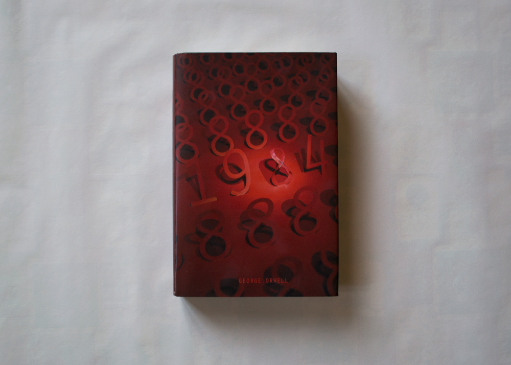
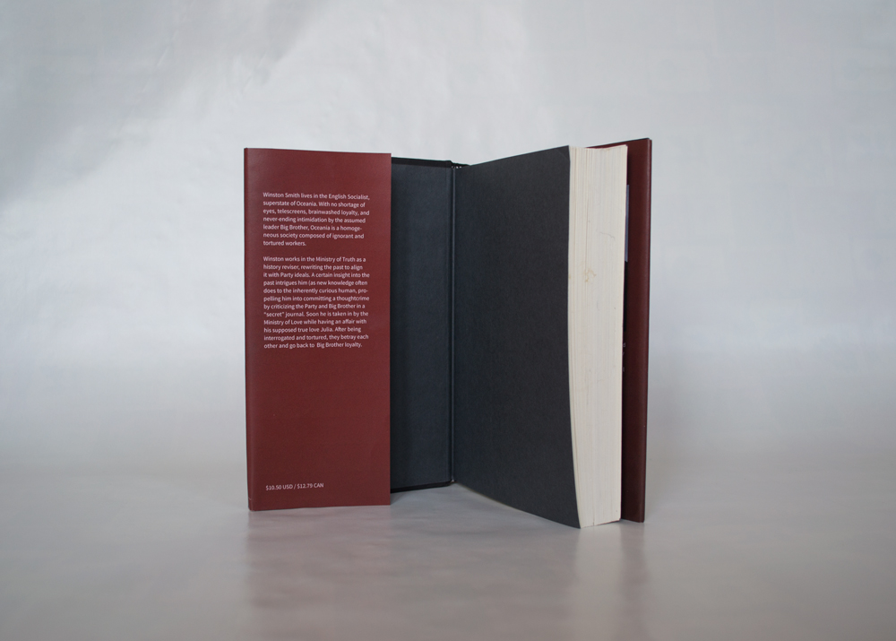
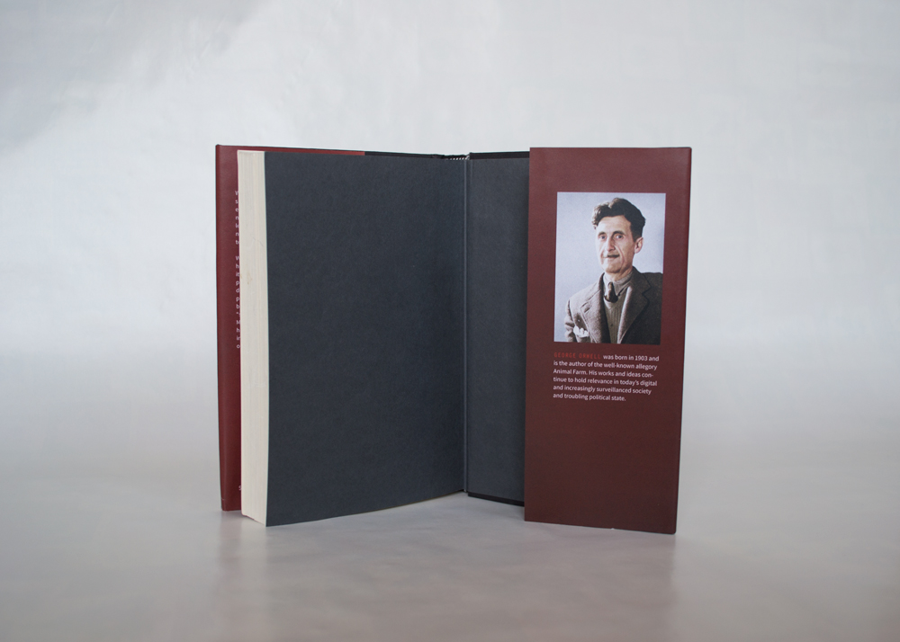

# 1984 book coverseptember 2017

>___  
[process](../documents/1984_process_vannavu.pdf){:target="_blank"} 

## Full jacket design anchored in type, material, and metaphor

Shooting off 1984's dystopian components of homogeneity and inhumanity, I focused on capturing the main character's story without giving it away. The cover's scene was made with paper, staples, and a bike light.

 

 

 

>___  
[process](../documents/1984_process_vannavu.pdf){:target="_blank"} 