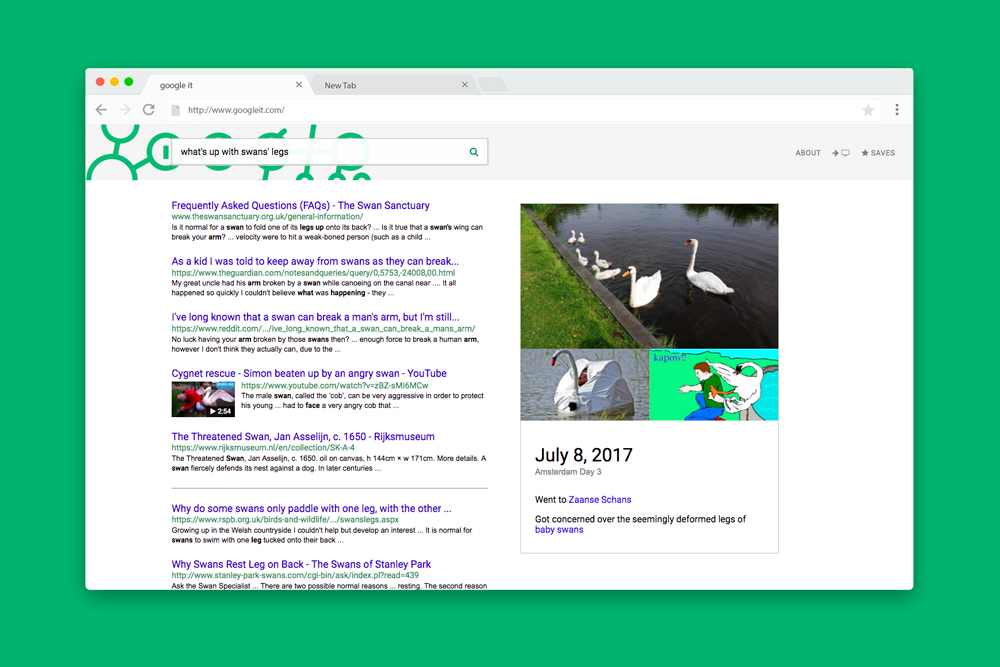
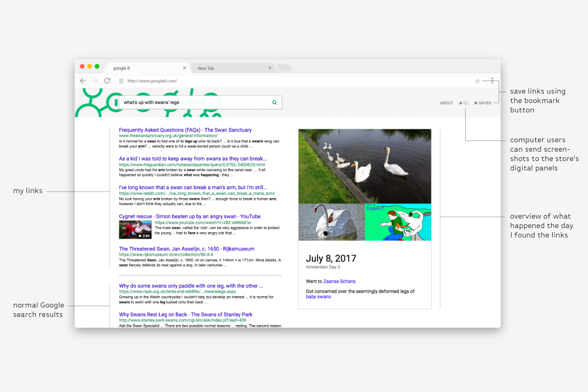
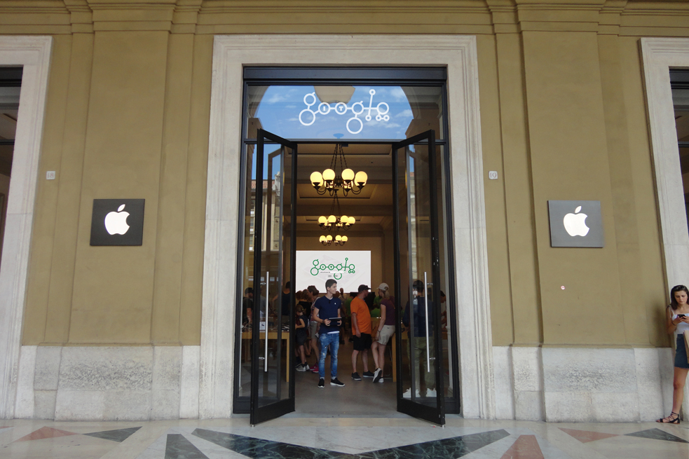
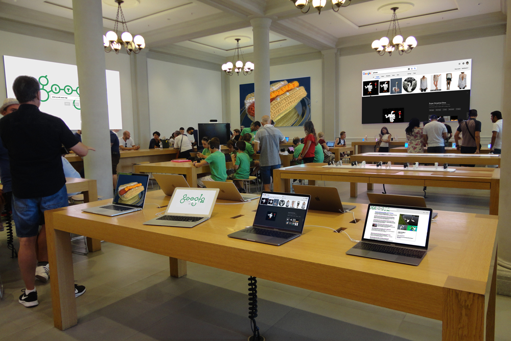
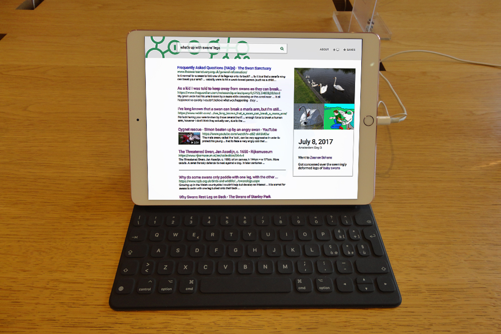
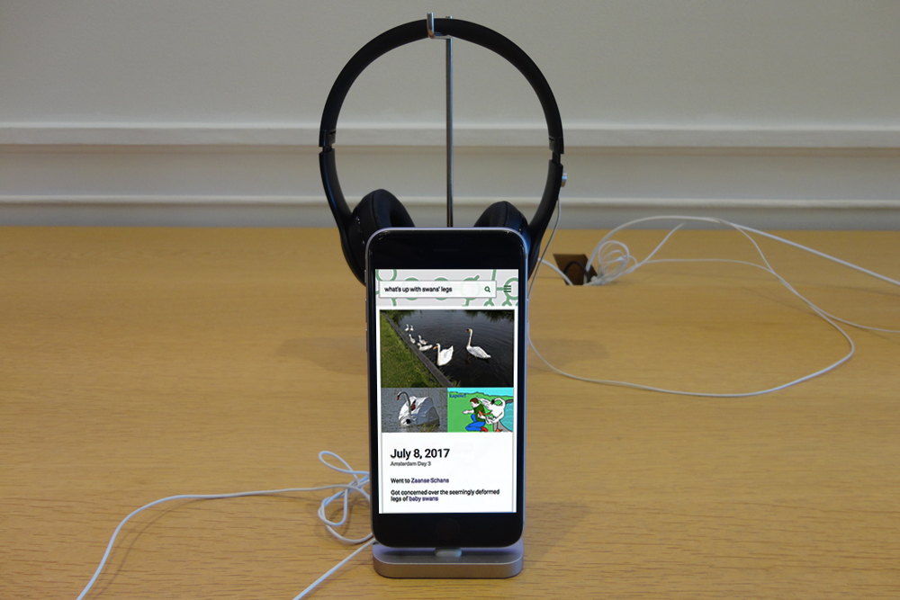

# google itjuly 2017

## Googling thoughts and experiences during my study abroad in Italy and ending up with buff swans and Weird Al

>

*Google it* is a collection of search results from [google.it](https://www.google.it/) (Google's Italian domain). [Its raw form](https://docs.google.com/document/d/12fWVyDn5NhMiUF-3HnAWfLtgn3GY1sLBh3_Zs8_7rLw/edit){:target="_blank"} is a shorthand journal made in Google Docs that is composed of phrases and hyperlinks. In its hypothetically curated form, it is [an alternative organization](../google_it_demo/example_home.html){:target="_blank"} of Google search results exhibited in Florence's Apple store. 

###### &mdash; [try it out](../google_it_demo/example_home.html){:target="_blank"}; it works on phones, tablets, and computers

###### &mdash; the Apple store has 5 digital screens that were repurposed for this project

The Google interface and Apple store were hijacked to change their pragmatic or retail purposes into hubs of discovery. Since Google's interface remains the same visually, navigation is intuitive. The format of the Apple store is also familiar to many people around the world. 

###### &mdash; participants can share their searches on the screens

###### &mdash; different devices offer different experiences

The Internet is a multiplier to what we see everyday. By Google searching a day’s experiences, I deliberately added to the amount I saw. But I also expanded on those experiences and learned more beyond the original search term due to how Google compiles and connects different webpages.

By showing people what you can find and learn through a simple Google search, the function of Google moves beyond fact checking and becomes an opportunity to find obscure, cultural artifacts or whatever you choose to look for. Google is the *compiler*, but it doesn’t necessarily have to be the *controller* of knowledge. Which links you choose and how you synthesize them can be a more deliberate decision. 

###### &mdash; logo was based on glasses, <i class="fa fa-search" aria-hidden="true"></i> and <i class="fa fa-share-alt" aria-hidden="true"></i>

>___  
- [explore the archive](https://docs.google.com/document/d/12fWVyDn5NhMiUF-3HnAWfLtgn3GY1sLBh3_Zs8_7rLw/edit){:target="_blank"}  
- [try the demo](../google_it_demo/example_home.html){:target="_blank"}   
- [more info](http://walkerteach.me/summer17washu/09/exercises/final/index.html){:target="_blank"}