# Promptjune 2017

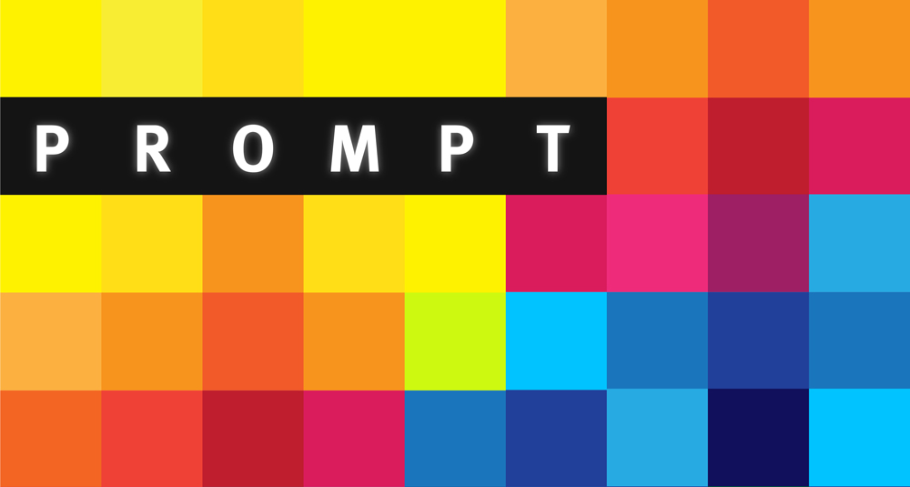

## A mosaic in motion that invites passersby in Florence's Santa Maria Novella train station to leave a mark

*Prompt* was created in response to the prevalent amount of meaningless graffiti and tagging in Florence, such as areas around SRISA, the Duomo, the train station, to Uffizi bathroom stalls and even pillars at the top of the Duomo.

These forms of graffiti are selfish, antisocial, and spawn from an inherent urge to leave a mark on a blank surface, one that isn’t ours. The anonymous ownership is thrilling; they don’t want to be seen doing the act, but they want the act to be seen. "They" could be a local, a passerby, or a tourist.

Most of us ignore these random signatures on walls, plethora of penises on every corner, and romantic declarations of love on bathroom stalls. Some see these as an invitation to make their own mark. How can we channel these urges into something more sightly, productive, and meaningful? Something worthy of its permanence?

The direct intent of *Prompt* is to encourage the passersby to become a participant, to react, interact with, and shape their immediate environment while changing how the public mark is made and changing what it can mean.

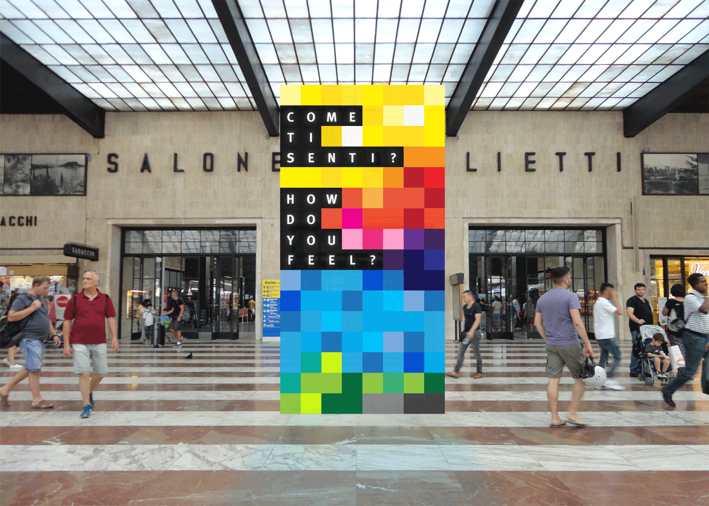

###### &mdash; the view upon exiting the trains; the doors lead to the seating hub

The digital drawing board invites passersby to leave a mark in the Santa Maria Novella train station. It is situated in the center of the long walkway, outside the doors of the main seating hub.

>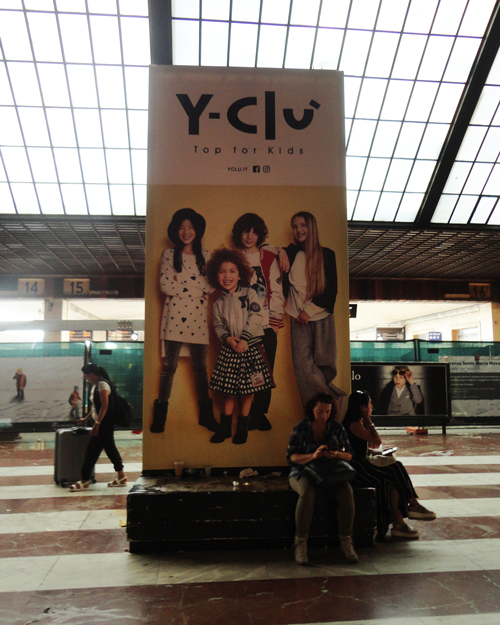  
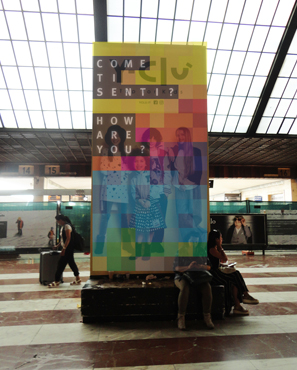

Florence, rooted in tradition, is not a digitalized city. Unlike the glowing billboard screens of New York City, Florence predominantly uses paper-based displays, backlit signs, or, as in the train station, bulb-based info-boards. The digital screen of *Prompt* will be intriguing in comparison.

The drawing board may seem out of place for the same reason, but its proportions and size are the same as the advertisements to the far left and right of it, creating a trio of sorts. The touchscreen tablet is also familiar, like a smartphone, making the experience less intimidating than, for example, spraypaint.

The typeface Meta, a humanist sans-serif, was also used so as to not shock a city where Comic Sans is not uncommon.

The screen makes eye contact with passersby, but the question&mdash;the prompt&mdash;is the wave hello, a cue for interaction. A question as simple as &#8220;How are you?&#8221; elicits an immediate answer. The intent is not only to invite the passerby to participate; it is to also invert the context that graffiti is usually done in.

A tablet-kiosk is attached to the screen facing the seating hub, allowing the bored people in the hub to spectate (and hopefully encouraging them to contribute).

Since the train station facilitates diverse travellers from all over the world, the participant is welcomed with a language selection screen.

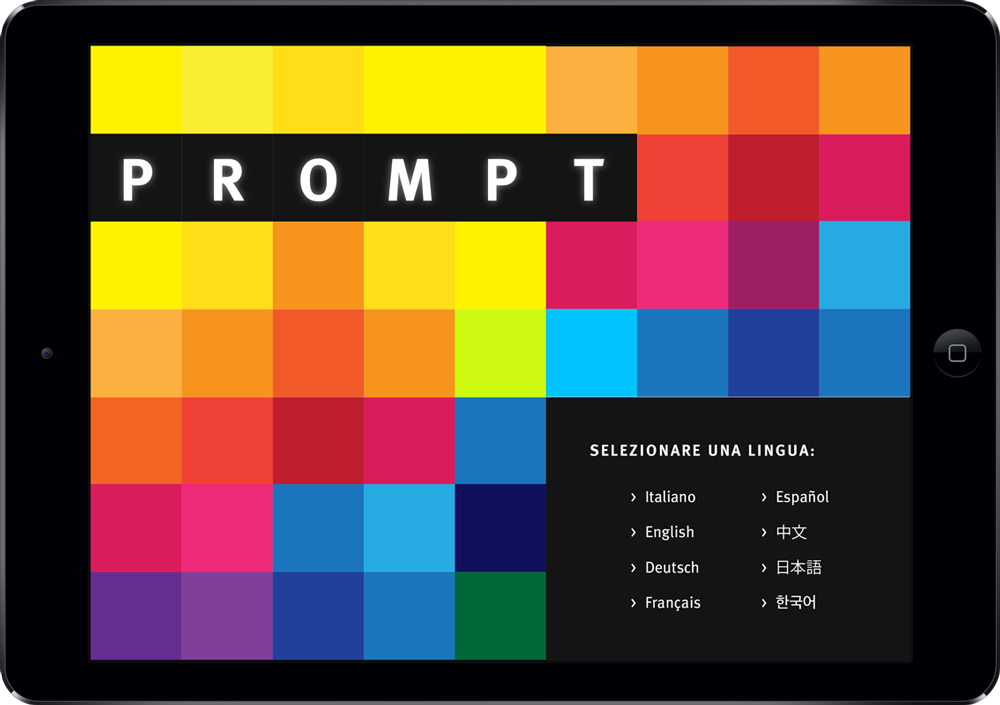

After selecting a language, the participant is asked to sign their name. This quells the default signature or  &#8220;____ wuz here &#8221; responses, otherwise known as marks of ownership and existence.

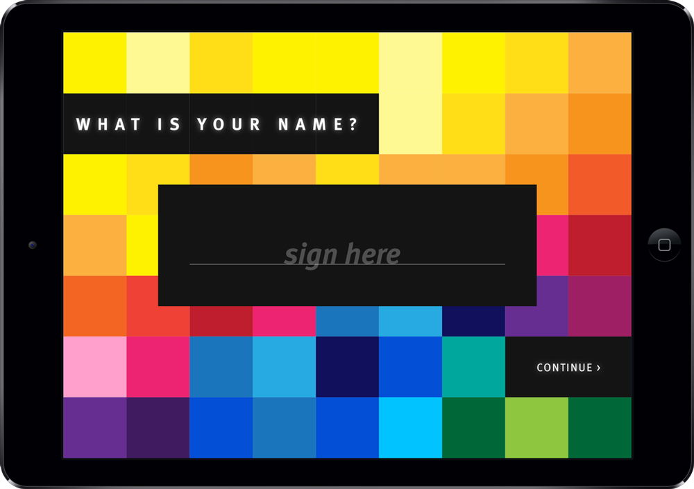

The sharing of a name also forms a vulnerability in the participant. The connecting of an identity to the drawing at least lightly pulls at a sense of responsibility over what they’re creating. Maybe symbolically, they are signing a contract that says &#8220;I will not draw a swastika.&#8221;

The following screen reiterates the prompt to remind and guide the participant on what they should be responding to.

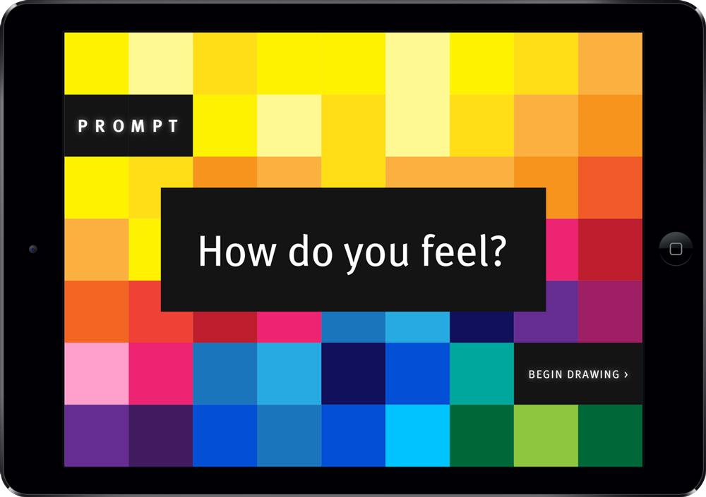

The participant is then instructed to select a canvas color, communicating that the palette is only for that and not the pen color. Once selected, the one and a half minute timer will begin, making this a "prompt" drawing.

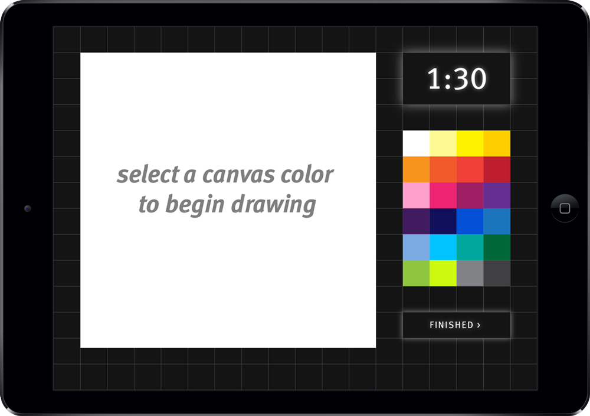

The canvas is to scale (approximately an 8 inch square) on the tablet, and the drawing tool is a black pen set at 50% opacity. The one tool paired with the time limit forces the participant to focus on answering the prompt. The time limit also ensures that people do not hog the tablet.

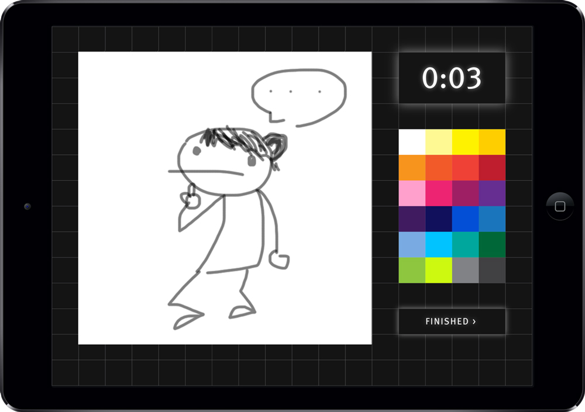

###### &mdash; doodled by a friend

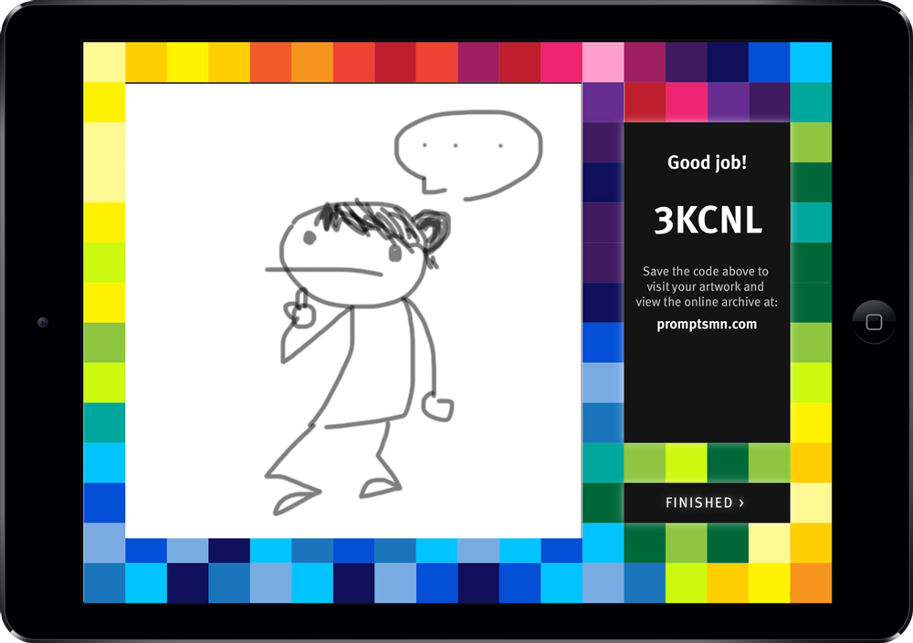

Once the participant finishes or time runs out, they will have options to save and share their drawing. The drawing will then transfer to the display board, replacing the oldest tile. Every contribution will change the organization of the board.

The set canvas palette in combination with the computerized display allows for greater organization and control over the output. The display groups the drawings by color family. With the specific prompt "How do you feel?" the dominating color group may suggest that a majority of people are happy or calm and content. Changes to the regular scheme may reflect the day's events, such as a soccer win for Italy or a bad day for politics.

Even if the drawings themselves aren't masterpieces, the participant has still contributed to a coherent mosaic in less than 5 minutes.

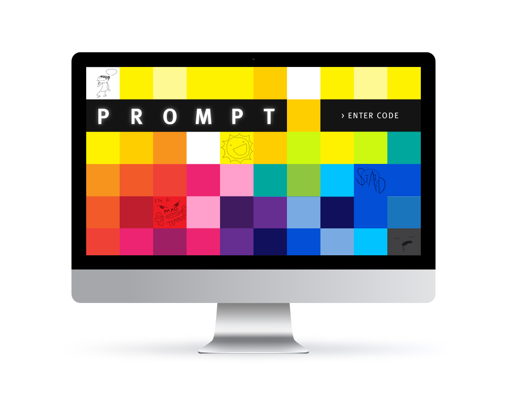

>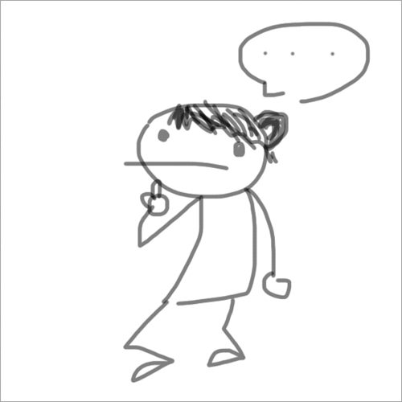   
##### &mdash; *try hovering*

## Accompanying the digital board is an archival website that allows for alternative modes of viewing the tiles&mdash;it is essentially an interactive data visualization

Since both the people and drawings are transient in the train station, an accompanying website will be implemented to align with longer-lasting nature of graffiti. The drawings will be instantly uploaded to an online archive that allows for expanded viewing options based on color, chronology, date, and/or time range. Hovering over the drawings will reveal info on the date created, the prompt responded to, and the artist.

Participating in this digital board would liven the environment of the train station in providing an alternate activity to sitting mindlessly or shopping and eating. Moreover, it could change the way people perceive the public mark. Sharpie scrawls on bathroom stalls may seem pointless and petty in comparison.

Instead of a meaningless mark made in private, a beautifying, collaborative, and reflective one could be created.

