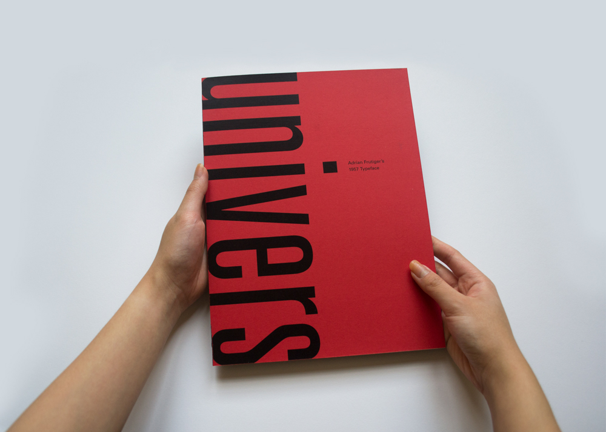
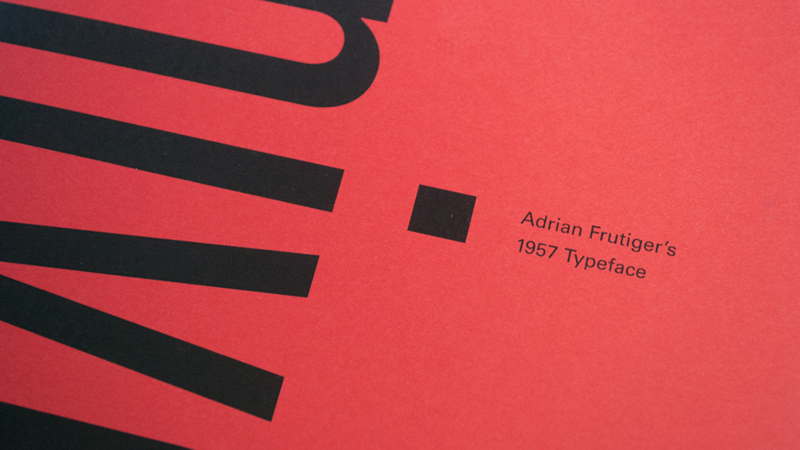
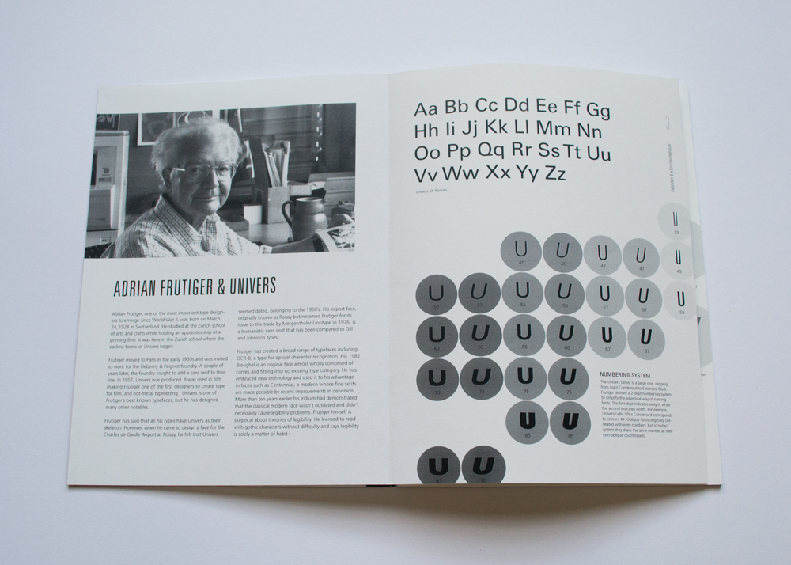
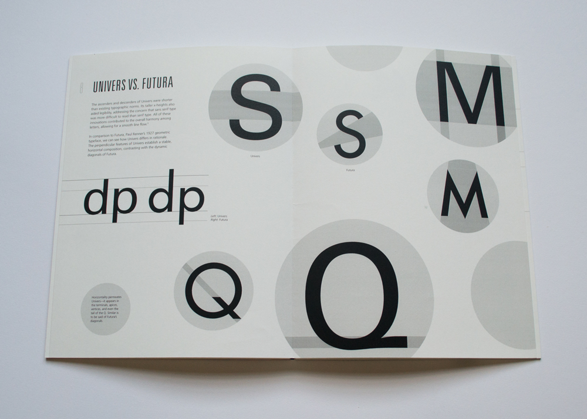
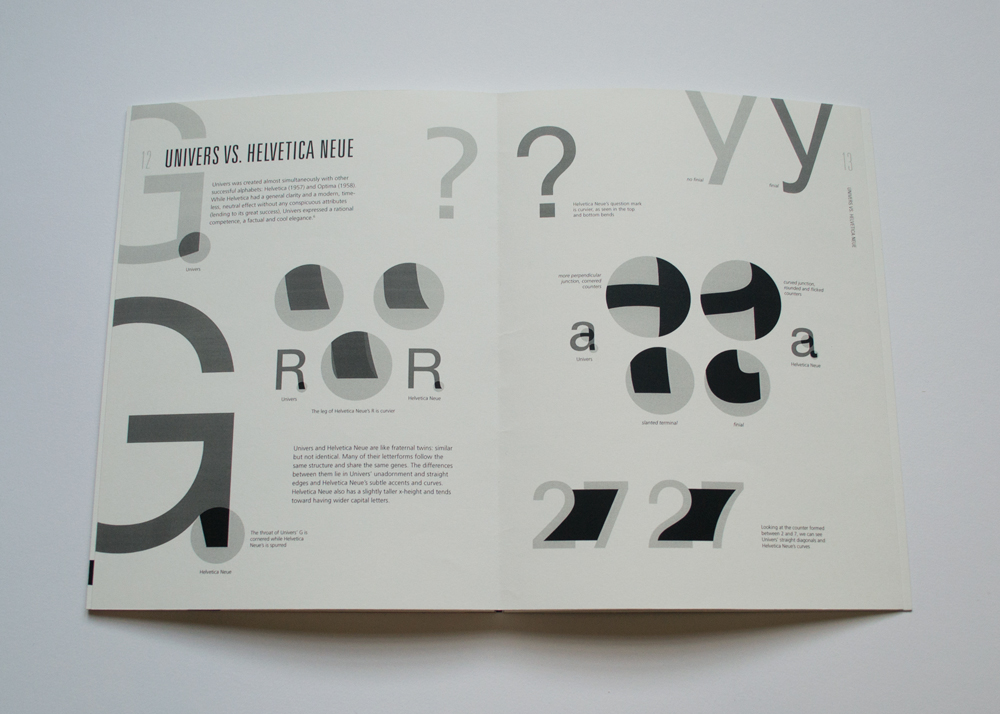
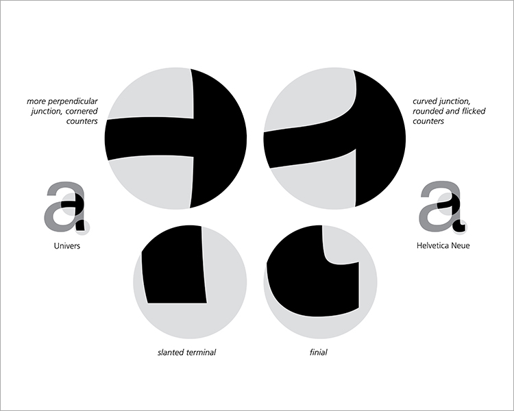
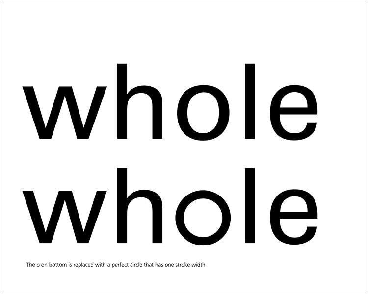
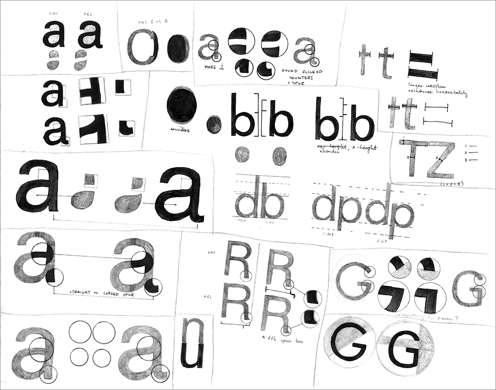

# Univers type bookmay 2017

###### &mdash; 7.75" x 10.5"  

## A study of Univers with layouts and diagrams emphasizing the typeface's horizontal flow

###### &mdash; accordion bound

###### &mdash; sketches on tracing paper  

>___ 
- [full book](https://issuu.com/vanna_vu/docs/univers){:target="_blank"}  
- [process](../documents/univers_process_vannavu.pdf){:target="_blank"}  
